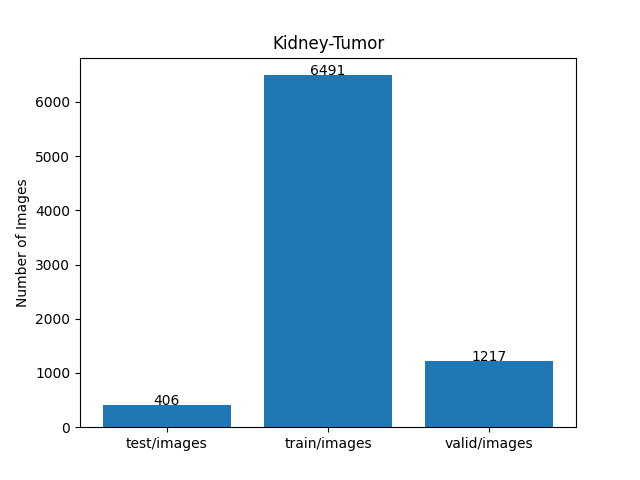

<h2>TensorFlow-FlexUNet-Image-Segmentation-KiTS19-Kidney-Tumor (2025/07/04)</h2>

This is the first experiment of Image Segmentation for Kidney-Tumor based on our TensorFlowFlexUNet (TensorFlow Flexible UNet Image Segmentation Model for Multiclass) and a 512x512 pixels 
<a href="https://drive.google.com/file/d/1CEPS71AZJtyOXgk-ZksT5b4JXOis8DyW/view?usp=sharing">
Kits19-Kidney-Tumor-ImageMask-Dataset.zip</a>.
which was derived by us from  
<a href="https://www.kaggle.com/datasets/user123454321/kits19-2">
<b>
Kits19-2</b>
</a>
 
 
<b>Acutual Image Segmentation for 512x512 Kidney-Tumor images</b> 
As shown below, the inferred masks look very similar to the ground truth masks. 
The blue region represents a kidney, and the red a tumor respectively.  
<table>
<tr>
<th>Input: image</th>
<th>Mask (ground_truth)</th>
<th>Prediction: inferred_mask</th>
</tr>
<tr>
<td></td>
<td></td>
<td></td>
</tr>
<tr>
<td></td>
<td></td>
<td></td>
</tr>
<tr>
<td></td>
<td></td>
<td></td>
</tr>
</table>

 
<h3>1. Dataset Citation</h3>
The dataset used here has been taken from the following kaggle web site.
 
<a href="https://www.kaggle.com/datasets/user123454321/kits19-2">
<b>
Kits19-2</b>
</a>
  
<b>The official [2019 KiTS Challenge]</b>
https://kits19.grand-challenge.org 

<b>The official 2019 KiTS Challenge repository.</b>
https://github.com/neheller/kits19 

Please see also: <a href="https://kits-challenge.org/kits23/">[KiTS23 Homepage]</a>  
<a href="https://kits19.grand-challenge.org/data/"><b>Challenge Data</b></a>
 
<b>License: </b>
The following applies to all content in this repository EXCEPT that within the data/ subdirectory. 
 
<b>MIT License</b> 
Copyright (c) 2019 Nicholas Heller 
Permission is hereby granted, free of charge, to any person obtaining a copy 
of this software and associated documentation files (the "Software"), to deal 
in the Software without restriction, including without limitation the rights 
to use, copy, modify, merge, publish, distribute, sublicense, and/or sell 
copies of the Software, and to permit persons to whom the Software is 
furnished to do so, subject to the following conditions: 

The above copyright notice and this permission notice shall be included in all 
copies or substantial portions of the Software. 
 
THE SOFTWARE IS PROVIDED "AS IS", WITHOUT WARRANTY OF ANY KIND, EXPRESS OR 
IMPLIED, INCLUDING BUT NOT LIMITED TO THE WARRANTIES OF MERCHANTABILITY, 
FITNESS FOR A PARTICULAR PURPOSE AND NONINFRINGEMENT. IN NO EVENT SHALL THE 
AUTHORS OR COPYRIGHT HOLDERS BE LIABLE FOR ANY CLAIM, DAMAGES OR OTHER 
LIABILITY, WHETHER IN AN ACTION OF CONTRACT, TORT OR OTHERWISE, ARISING FROM, 
OUT OF OR IN CONNECTION WITH THE SOFTWARE OR THE USE OR OTHER DEALINGS IN THE 
SOFTWARE. 
 
<h3>
<a id="2">
2 Kidney-Tumor ImageMask Dataset
</a>
</h3>
 If you would like to train this Kidney-Tumor Segmentation model by yourself,
 please download the dataset from the google drive  
<a href="https://drive.google.com/file/d/1CEPS71AZJtyOXgk-ZksT5b4JXOis8DyW/view?usp=sharing">
Kits19-Kidney-Tumor-ImageMask-Dataset.zip</a>.
 
, expand the downloaded ImageMaskDataset and put it under <b>./dataset</b> folder to be
<pre>
./dataset
└─Kidney-Tumor
    ├─test
    │   ├─images
    │   └─masks
    ├─train
    │   ├─images
    │   └─masks
    └─valid
        ├─images
        └─masks
</pre>
 
<b>Kidney-Tumor Statistics</b> 
 
 
On the derivation of the dataset, please refer to the following Python scripts: 
<li><a href="./generator/ImageMaskDatasetGenerator.py">ImageMaskDatasetGenerator.py</a></li>
<li><a href="./generator/split_master.py">split_master.py</a></li>
 
As shown above, the number of images of train and valid datasets is large enough to use for a training set of our segmentation model.
 
 
<b>Train_images_sample</b> 

 
<b>Train_masks_sample</b> 

 
<h3>
3 Train TensorFlowFlexUNet Model
</h3>
 We trained Kidney-Tumor TensorFlowFlexUNet Model by using the following
<a href="./projects/TensorFlowFlexUNet/Kidney-Tumor/train_eval_infer.config"> <b>train_eval_infer.config</b></a> file.  
Please move to ./projects/TensorFlowFlexUNet/Kidney-Tumor and run the following bat file. 
<pre>
>1.train.bat
</pre>
, which simply runs the following command. 
<pre>
>python ../../../src/TensorFlowFlexUNetTrainer.py ./train_eval_infer.config
</pre>

<b>Model parameters</b> 
Defined a small <b>base_filters = 16 </b> and large <b>base_kernels = (9,9)</b> for the first Conv Layer of Encoder Block of 
<a href="./src/TensorFlowFlexUNet.py">TensorFlowFlexUNet.py</a> 
and a large num_layers (including a bridge between Encoder and Decoder Blocks).
<pre>
[model]
;You may specify your own UNet class derived from our TensorFlowFlexModel
model         = "TensorFlowFlexUNet"
generator     =  False
image_width    = 512
image_height   = 512
image_channels = 3
num_classes    = 3

base_filters   = 16
base_kernels   = (9,9)
num_layers     = 8
dropout_rate   = 0.04
dilation       = (1,1)
</pre>
<b>Learning rate</b> 
Defined a very small learning rate.  
<pre>
[model]
learning_rate  = 0.00007
</pre>
<b>Loss and metrics functions</b> 
Specified "categorical_crossentropy" and <a href="./src/dice_coef_multiclass.py">"dice_coef_multiclass"</a>. 
<pre>
[model]
loss           = "categorical_crossentropy"
metrics        = ["dice_coef_multiclass"]
</pre>
<b>Dataset class</b> 
Specifed <a href="./src/ImageCategorizedMaskDataset.py">ImageCategorizedMaskDataset</a> class. 
<pre>
[dataset]
class_name    = "ImageCategorizedMaskDataset"
</pre>
 
<b>Learning rate reducer callback</b> 
Enabled learing_rate_reducer callback, and a small reducer_patience.
<pre> 
[train]
learning_rate_reducer = True
reducer_factor     = 0.5
reducer_patience   = 4
</pre>
<b>Early stopping callback</b> 
Enabled early stopping callback with patience parameter.
<pre>
[train]
patience      = 10
</pre>

<b>RGB Color map</b> 
rgb color map dict for Kidney-Tumor 1+2 classes. 
<pre>
[mask]
mask_file_format = ".png"
; background   black  kidney:blue, tumor:red
rgb_map = {(0,0,0):0, (0,0,255):1, (255,0,0):2,}
</pre>

<b>Epoch change inference callback</b> 
Enabled <a href="./src/EpochChangeInfereuncer.py">epoch_change_infer callback</a></b>. 
<pre>
[train]
epoch_change_infer       = True
epoch_change_infer_dir   =  "./epoch_change_infer"
num_infer_images         = 6
</pre>

By using this callback, on every epoch_change, the inference procedure can be called
 for 6 images in <b>mini_test</b> folder. This will help you confirm how the predicted mask changes 
 at each epoch during your training process.    

<b>Epoch_change_inference output at starting (epoch 1,2,3)</b> 
 
 
<b>Epoch_change_inference output at middlepoint (epoch 31,32,33)</b> 
 
 
<b>Epoch_change_inference output at ending (epoch 63,64,65)</b> 
 
 
In this experiment, the training process was stopped at epoch 65 by EarlyStopping callback.  
 
 

<a href="./projects/TensorFlowFlexUNet/Kidney-Tumor/eval/train_metrics.csv">train_metrics.csv</a> 
 

 
<a href="./projects/TensorFlowFlexUNet/Kidney-Tumor/eval/train_losses.csv">train_losses.csv</a> 
 

 

<h3>
4 Evaluation
</h3>
Please move to <b>./projects/TensorFlowFlexUNet/Kidney-Tumor</b> folder, 
and run the following bat file to evaluate TensorFlowFlexUNet model for Kidney-Tumor. 
<pre>
./2.evaluate.bat
</pre>
This bat file simply runs the following command.
<pre>
python ../../../src/TensorFlowFlexUNetEvaluator.py ./train_eval_infer_aug.config
</pre>

Evaluation console output: 

  

<a href="./projects/TensorFlowFlexUNet/Kidney-Tumor/evaluation.csv">evaluation.csv</a> 
The loss (categorical_crossentropy) to this Kidney-Tumor/test was very low and dice_coef_multiclass 
very high as shown below.
 
<pre>
categorical_crossentropy,0.0023
dice_coef_multiclass,0.9989
</pre>
 

<h3>
5 Inference
</h3>
Please move <b>./projects/TensorFlowFlexUNet/Kidney-Tumor</b> folder 
,and run the following bat file to infer segmentation regions for images by the Trained-TensorFlowFlexUNet model for Kidney-Tumor. 
<pre>
./3.infer.bat
</pre>
This simply runs the following command.
<pre>
python ../../../src/TensorFlowFlexUNetInferencer.py ./train_eval_infer_aug.config
</pre>

<b>mini_test_images</b> 
 
<b>mini_test_mask(ground_truth)</b> 
 

<b>Inferred test masks</b> 
 
 

<b>Enlarged images and masks of 512x512 pixels</b> 

<table>
<tr>
<th>Image</th>
<th>Mask (ground_truth)</th>
<th>Inferred-mask</th>
</tr>

<tr>
<td></td>
<td></td>
<td></td>
</tr>

<tr>
<td></td>
<td></td>
<td></td>
</tr>

<tr>
<td></td>
<td></td>
<td></td>
</tr>

<tr>
<td></td>
<td></td>
<td></td>
</tr>

<tr>
<td></td>
<td></td>
<td></td>
</tr>

<tr>
<td></td>
<td></td>
<td></td>
</tr>
</table>

 
<h3>
References
</h3>

<b>1. The official [2019 KiTS Challenge] </b> 
<a href="https://kits19.grand-challenge.org">
https://kits19.grand-challenge.org
</a>
 
 

<b>2. The official 2019 KiTS Challenge repository.</b> 
Nicholas Heller 
<a href="https://github.com/neheller/kits19">
https://github.com/neheller/kits19
</a>
 
 
<b>3. The state of the art in kidney and kidney tumor segmentation in contrast-enhanced CT imaging: Results of the KiTS19 challenge</b> 
Nicholas Heller, Fabian Isensee, Klaus H. Maier-Hein, Xiaoshuai Hou,  
Chunmei Xie, Fengyi Li, Yang Nan, Guangrui Mu, Zhiyong Lin,  
Miofei Han, Guang Yao, Yaozong Gao, Yao Zhang, Yixin Wang, Feng Hou,  
Jiawei Yang, Guangwei Xiong, Jiang Tian, Cheng Zhong, Jun Ma, Jack Rickman, 
Joshua Dean, Bethany Stai, Resha Tejpaul, Makinna Oestreich, Paul Blake,  
Heather Kaluzniak, Shaneabbas Raza, Joel Rosenberg, Keenan Moore, Edward Walczak,  
Zachary Rengel, Zach Edgerton, Ranveer Vasdev, Matthew Peterson, Sean McSweeney, 
Sarah Peterson, Arveen Kalapara, Niranjan Sathianathen, Nikolaos Papanikolopoulos, 
Christopher Weight 
<a href="https://www.sciencedirect.com/science/article/abs/pii/S1361841520301857?via%3Dihub">
https://www.sciencedirect.com/science/article/abs/pii/S1361841520301857?via%3Dihub
</a>
 
 
<b>4. Kidney Tumor Segmentation Based on FR2PAttU-Net Model</b> 
Peng Sun, Zengnan Mo, Fangrong Hu, Fang Liu, Taiping Mo, Yewei Zhang and Zhencheng Chen 
<a href="https://www.frontiersin.org/journals/oncology/articles/10.3389/fonc.2022.853281/full">
https://www.frontiersin.org/journals/oncology/articles/10.3389/fonc.2022.853281/full
</a>
 
 
<b>5. MSS U-Net: 3D segmentation of kidneys and tumors from CT images with a multi-scale supervised U-Net</b> 
Wenshuai Zhao, Dihong Jiang, Jorge Peña Queralta, Tomi Westerlund 
<a href="https://www.sciencedirect.com/science/article/pii/S2352914820301969">
https://www.sciencedirect.com/science/article/pii/S2352914820301969
</a>
 
 
<b>6. Tensorflow-Image-Segmentation-Kidney-Tumor</b> 
Toshiyuki Arai @antillia.com 
<a href="https://github.com/sarah-antillia/Tensorflow-Image-Segmentation-Kidney-Tumor">
https://github.com/sarah-antillia/Tensorflow-Image-Segmentation-Kidney-Tumor
</a>
